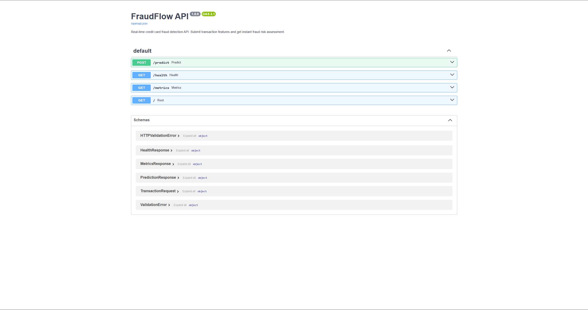
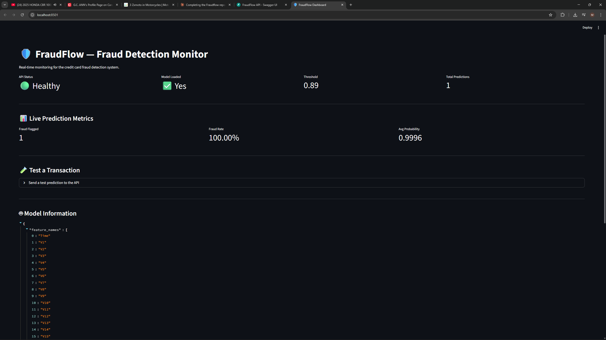

# 🛡️ FraudFlow

**Production-grade credit card fraud detection with full MLOps pipeline.**

[](https://github.com/mharis8598/fraudflow/actions/workflows/ci.yml)
[](https://github.com/mharis8598/fraudflow/actions/workflows/cd.yml)
[](https://www.python.org/downloads/)
[](https://www.docker.com/)
[](LICENSE)

---

## The Problem

Credit card fraud costs financial institutions billions annually. Rule-based detection systems miss sophisticated fraud patterns and can't adapt as tactics evolve. Organizations need ML models that detect fraud in real-time, retrain automatically, and run reliably with full auditability.

## The Solution

FraudFlow is an **end-to-end fraud detection system** — not just a model in a notebook, but a fully deployed, containerized ML pipeline with:

- 🤖 **XGBoost classifier** achieving **0.97 ROC AUC** on 284K transactions
- 🚀 **FastAPI** serving real-time predictions with auto-generated docs
- 📊 **MLflow** experiment tracking with model versioning
- 📈 **Streamlit** monitoring dashboard with drift detection
- 🐳 **Docker Compose** for one-command deployment
- ⚡ **GitHub Actions** CI/CD with automated testing and image builds
- 🔍 **Evidently AI** data drift monitoring

## Screenshots

### FastAPI — Swagger UI (`/docs`)



### Streamlit — Monitoring Dashboard



## Architecture

```
┌──────────────┐    ┌──────────────┐    ┌──────────────┐
│  Raw Data    │───▶│  Training    │───▶│  MLflow      │
│  (284K txns) │    │  Pipeline    │    │  Registry    │
└──────────────┘    │  SMOTE +     │    │  Experiments │
                    │  XGBoost     │    │  + Metrics   │
                    └──────────────┘    └──────┬───────┘
                                               │
                    ┌──────────────┐            │
                    │  Streamlit   │◀───┐       │
                    │  Dashboard   │    │       ▼
                    │  Monitoring  │    │  ┌──────────────┐
                    └──────────────┘    ├──│  FastAPI      │
                                        │  │  /predict     │
                    ┌──────────────┐    │  │  /health      │
                    │  GitHub      │────┘  └──────────────┘
                    │  Actions     │              │
                    │  CI/CD       │         ┌────▼─────┐
                    └──────────────┘         │  Docker  │
                                             └──────────┘
```

## Quick Start

### Prerequisites

- Python 3.11+
- Docker & Docker Compose (optional)

### Option 1: Local Setup

```bash
# Clone the repo
git clone https://github.com/mharis8598/fraudflow.git
cd fraudflow

# Install dependencies
make install

# Download dataset from Kaggle and place in data/raw/
# https://www.kaggle.com/datasets/mlg-ulb/creditcardfraud

# Train the model
make train

# Start the API
make serve

# In another terminal — start the dashboard
make dashboard
```

### Option 2: Docker Compose

```bash
# Train the model first (needs local Python)
make train

# Start all services
make docker-up

# API:       http://localhost:8000/docs
# MLflow:    http://localhost:5000
# Dashboard: http://localhost:8501
```

## API Usage

### Predict Fraud

```bash
curl -X POST http://localhost:8000/predict \
  -H "Content-Type: application/json" \
  -d '{
    "Time": 406.0,
    "V1": -2.312, "V2": 1.951, "V3": -1.609, "V4": 3.997,
    "V5": -0.522, "V6": -1.426, "V7": -2.537, "V8": 1.391,
    "V9": -2.770, "V10": -2.772, "V11": 3.202, "V12": -2.899,
    "V13": -0.595, "V14": -4.289, "V15": 0.389, "V16": -1.140,
    "V17": -2.830, "V18": -0.016, "V19": 0.416, "V20": 0.126,
    "V21": 0.517, "V22": -0.035, "V23": -0.465, "V24": -0.818,
    "V25": -0.094, "V26": 0.247, "V27": 0.083, "V28": 0.078,
    "Amount": 239.93
  }'
```

**Response:**

```json
{
  "fraud_probability": 0.9996,
  "is_fraud": true,
  "risk_level": "CRITICAL",
  "threshold": 0.89
}
```

### Health Check

```bash
curl http://localhost:8000/health
```

### Prediction Metrics

```bash
curl http://localhost:8000/metrics
```

## Model Performance

| Metric | Score |
| --- | --- |
| ROC AUC | 0.971 |
| Precision | 0.936 |
| Recall | 0.768 |
| F1 Score | 0.844 |
| Optimal Threshold | 0.89 |
| False Positives | 5 / 56,651 |
| Latency | <50ms |

*Trained on the [Kaggle Credit Card Fraud dataset](https://www.kaggle.com/datasets/mlg-ulb/creditcardfraud) — 283,726 transactions after deduplication (492 fraudulent, 0.17% fraud rate). Threshold tuned to maximize F1 score.*

## Project Structure

```
fraudflow/
├── .github/workflows/     # CI/CD pipelines
│   ├── ci.yml             # Lint + test on push
│   └── cd.yml             # Docker build on merge
├── api/                   # FastAPI application
│   ├── main.py            # API endpoints
│   └── schemas.py         # Pydantic models
├── src/                   # ML pipeline
│   ├── data_processing.py # Load, clean, split, SMOTE
│   ├── train.py           # Training + MLflow tracking
│   ├── predict.py         # Inference module
│   └── drift.py           # Data drift detection
├── dashboard/             # Streamlit monitoring UI
├── tests/                 # 51 tests (76% coverage)
│   ├── conftest.py        # Shared fixtures
│   ├── test_api.py        # API endpoint tests
│   ├── test_data_processing.py
│   ├── test_predict.py    # Predictor + risk level tests
│   ├── test_train.py      # Training pipeline tests
│   └── test_drift.py      # Drift detection tests
├── docs/                  # Screenshots
├── Dockerfile             # Container definition
├── docker-compose.yml     # Multi-service orchestration
├── Makefile               # Developer commands
└── requirements.txt       # Dependencies
```

## Tech Stack

| Component | Technology |
| --- | --- |
| ML Framework | scikit-learn, XGBoost |
| Class Imbalance | SMOTE (imbalanced-learn) |
| API | FastAPI + Uvicorn |
| Experiment Tracking | MLflow |
| Dashboard | Streamlit + Plotly |
| Drift Detection | Evidently AI |
| Containerization | Docker + Docker Compose |
| CI/CD | GitHub Actions |
| Testing | pytest (51 tests, 76% coverage) |
| Linting | Ruff |

## Development

```bash
make help          # Show all available commands
make test          # Run tests with coverage
make lint          # Lint with Ruff
make train         # Train model
make serve         # Start API (dev mode with reload)
make dashboard     # Start monitoring dashboard
make mlflow-ui     # Start MLflow tracking UI
make docker-up     # Start all services
make docker-down   # Stop all services
```

## What I Learned

- **MLOps is the gap:** Building a model is 20% of the work. Serving, monitoring, and maintaining it is the other 80%.
- **Threshold tuning > accuracy:** For imbalanced datasets (0.17% fraud rate), optimizing the classification threshold to 0.89 was more impactful than model tuning — it pushed precision to 94% while keeping recall at 77%.
- **Docker Compose orchestration:** Running multiple services (API + MLflow + dashboard) with shared volumes and networking.
- **CI/CD for ML:** Automated testing ensures model code doesn't break, and automated Docker builds ensure deployability.
- **Drift detection matters:** Models degrade silently — Evidently AI catches distribution shifts before they impact predictions.

## Future Improvements

- PostgreSQL for prediction logging and historical analysis
- Automated retraining triggered by drift detection
- Prometheus + Grafana for production-grade monitoring
- SHAP explanations for model interpretability
- A/B testing between model versions
- Kubernetes deployment with Terraform IaC

## Author

**Mikhail Haris** — Data Science Postgraduate | ML Engineer

- LinkedIn: [linkedin.com/in/mharis8598](https://linkedin.com/in/mharis8598)
- GitHub: [github.com/mharis8598](https://github.com/mharis8598)

## License

MIT License — see [LICENSE](LICENSE) for details.
